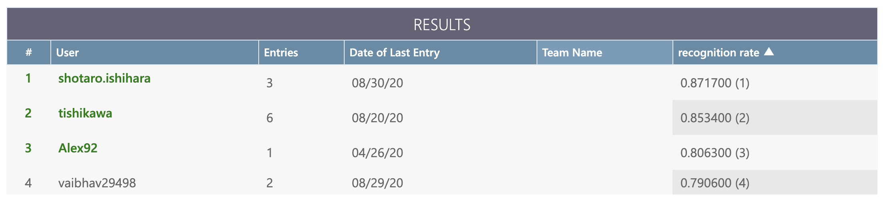
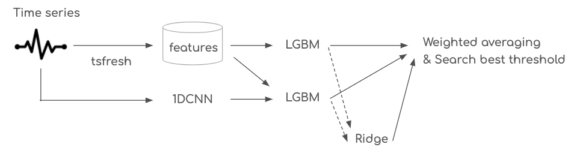
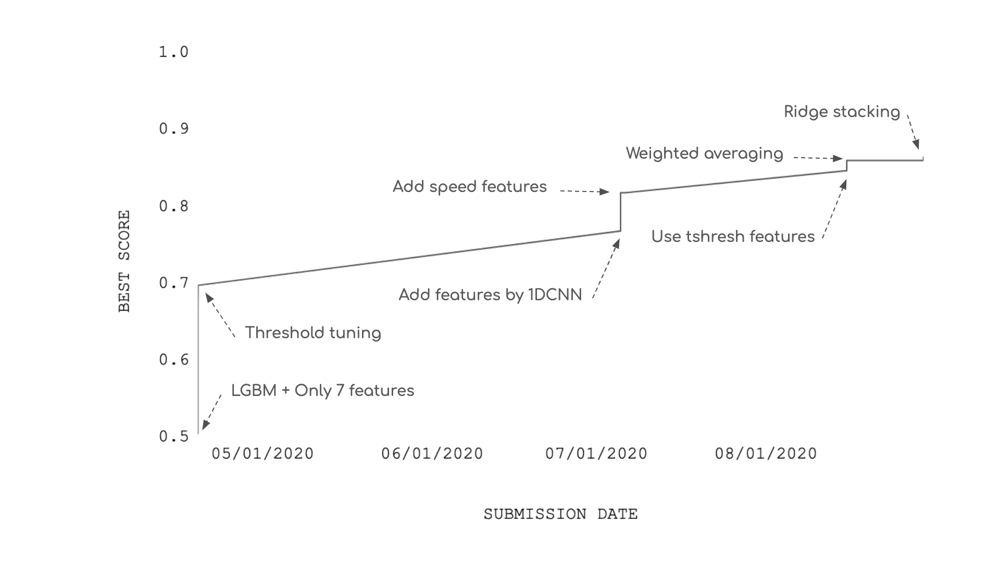

# Basketball Behavior Challenge BBC2020, 1st Place Solution

This repository contains 1st place solution codes of [Basketball Behavior Challenge BBC2020](https://competitions.codalab.org/competitions/23905). The task is to classify screen-play in basketball from trajectories of players and ball. Figure 1 is a final leaderboard.


Figure 1: Final leaderboard, https://competitions.codalab.org/competitions/23905#results.

## Solution Overview

The overview of the solution is shown in Figure 2. The final score is given by the weighted averaging of 3 predictions.

1. [LGBM](https://github.com/microsoft/LightGBM) with [tsfresh](https://github.com/blue-yonder/tsfresh)
1. LGBM with tsfresh and 1 dimension convolutional neural network (1DCNN)
1. Ridge stacking ([stacked generalization](https://www.researchgate.net/publication/222467943_Stacked_Generalization)) of prediction 1 and 2.


Figure 2: The solution overview.

More detailed information is described as follows.

- Validation strategy is [StratifiedKFold](https://scikit-learn.org/stable/modules/generated/sklearn.model_selection.StratifiedKFold.html) K=5.
- The number of features extracted by tsfresh is 11340.
    - (4 agents * 2 dimensions + 6 distances between agents ) * 810 features.
    - Feature importance by LGBM can be seen [here](./output/importance/run004-fi.png).
- Predictions by 1DCNN is added to features of LGBM.
    - The structure of 1DCNN is highly inspired by [the solution codes of atmaCup #5](https://github.com/amaotone/atmaCup-5) which was a competion with similar task.
- The weights for averaging (maximize AUC) and the threshold for 0/1 (maximize ACC) were determined by [Nelder-Mead](https://docs.scipy.org/doc/scipy/reference/optimize.minimize-neldermead.html) method.

LGBM with tsfresh gave me public score 0.8455 and LGBM with tsfresh and 1DCNN gave me 0.8482, and weighted averaging of them scored 0.8586. Ridge stacking of 2 LGBM created diversity, and boosted the score to 0.8639.

The transition of scores during the competition are shown in Figure 3.


Figure 3: Scores transition during the competition.

## Run codes

You can set up the Python 3 environment with [Docker Compose](https://docs.docker.com/compose/).

```bash
docker-compose up -d --build
docker exec -it basketball bash
```

You can run codes by `experiments/run.sh`. This implementation uses a supporting tool for machine learning competitions named [Ayniy](https://github.com/upura/ayniy).

```
sh experiments/run.sh
```
